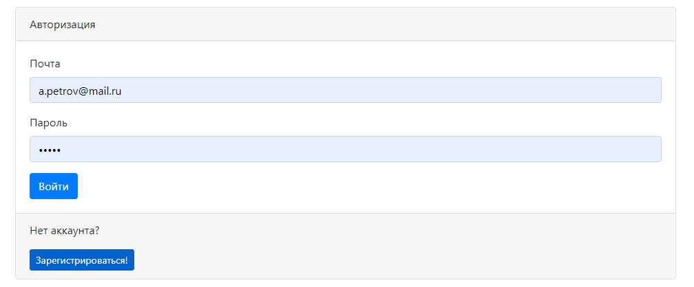

# Project job4j_dreamjob
[](https://app.travis-ci.com/EDGE775/job4j_dreamjob)
[](https://codecov.io/gh/EDGE775/job4j_dreamjob)
> This webapp realizes CRUD-system (create-read-update-delete) with using of principle of MVC (model-view-controller).

## Table of contents
* [General info](#general-info)
* [Technologies](#technologies)
* [Compilation](#compilation)
* [Status](#status)
* [Screenshots](#screenshots)
* [Contact](#contact)

## General info
This web application is a job exchange. 
The system can have two types of users: candidates and managers. 
Candidates can post a resume. Managers can post job vacancies.
Candidate can set a photo and download it after.
Only authorized users can view and add lists of vacancies and candidates.

## Technologies
* Java 14
* Java Servlets
* PostgreSQL
* JDBC
* Apache TomCat
* Libraries:
    - Apache Commons FileUpload
    - Apache Commons DBCP
    - GSON
* JSP/JSTL
* Javascript, AJAX, HTML, Bootstrap
* Junit, Mockito
* Maven

## Compilation
```
mvn clean compile
```

## Status
Project is: _in progress_

## Screenshots
#### Main page

#### Candidates page

#### Add candidates page

#### Registration

#### Authorization


## Contact
Created by Khlapov Dmitry - feel free to contact me!
